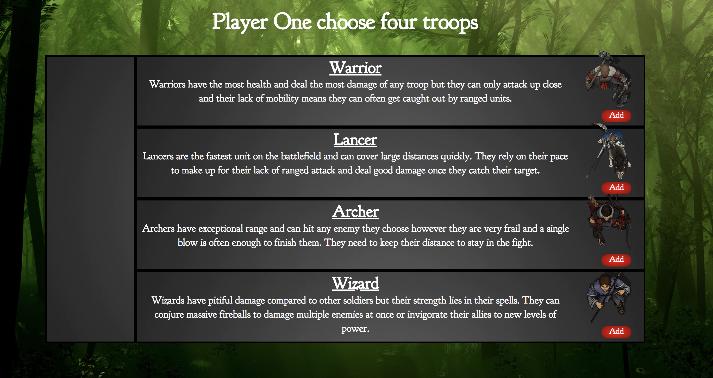
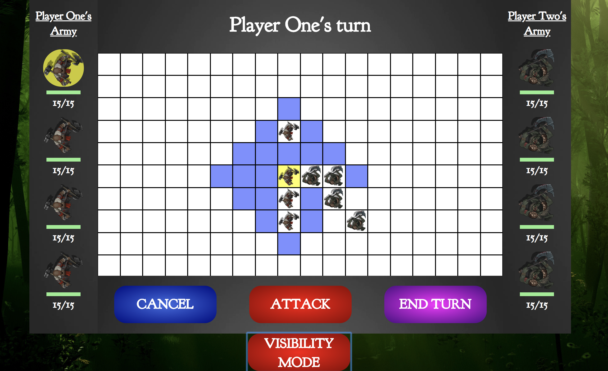
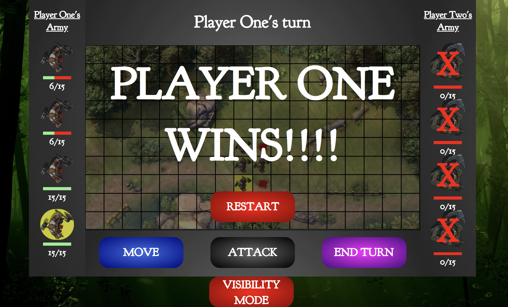
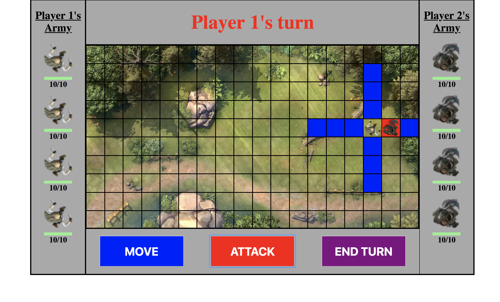

# General Assembly WDI Project 1: Jungle is Massive

[GitHub Pages](https://fwgbell.github.io/wdi-project-one/)

[GitHub Repo](https://github.com/fwgbell/wdi-project-one)

Jungle is Massive is my first project from General Assembly's Web Development Immersive course. It was an individual project built in just over a week, and was both the first fleshed out game I had built, and my first full project with JavaScript, having only been studying it for two weeks.

Jungle is Massive is a top-down, turn and grid based battle strategy game for two players that aims to be both fun and engaging as well as tactical and challenging.

___

## Brief

I had to:

* **Render a grid-based game in the browser**
* **Switch turns** between two players
* **Design logic for winning** & **visually display which player won**
* **Include separate HTML / CSS / JavaScript files**
* Use **Javascript or jQuery** for **DOM manipulation**
* Use **semantic markup** for HTML and CSS (adhere to best practices)

---

## Technologies Used:

* HTML5 with HTML5 audio
* CSS3 with animation
* JavaScript (ECMAScript6)
* jQuery
* Git
* GitHub
* Google Fonts
* Photoshop

---

## Screenshot Walk-through

### Main Title Page


### This leads to a select your troops page



### After each player has chosen their armys they place their troops on their half of the game grid


### Then the battle begins and they each take turns moving their troops and attacking their opponents


### I also added a visibility mode to make the troops more visible on the map if the user is struggling to see them



### Once one player has lost all of his troops the game ends and the victory screen declares the other player the victor



___

## Approach Taken

### Functionality

To begin the project I started work on my grid. I created a for loop that would use jQuery to create hundreds of numbered divs on my page and then it "cut out" the middle section I wanted to use. This gave me the grid size i wanted with each square having its own identifier number within it and meant that numbers at the edge of the grid weren't consecutive with numbers on the opposite side. This was intentional to stop movement over the edge of my map.

I then used objects to store the stats and location of my characters and worked on functions to handle their movement and attacks using the identifier numbers of my grid. All of this is controlled with the mouse and any changes that take place change the data in each characters object.

#### Featured piece of code 1

This piece of code generates the grid and numbers the squares accordingly. The large if statement selects the grid squares I wanted to keep for my game board. Further in my code all of the 'not-enterable' divs are removed from the page.

``` JavaScript
for(let i = 1; i < 600 ; i++){
  const $newDiv = $('<div></div>').addClass('not-enterable');
  $container.append($newDiv);
  if (i > 125 && i < 145 || i > 155 && i < 174 || i > 185 && i < 204 || i > 215 && i < 234
    || i > 245 && i < 264 || i > 275 && i < 294 || i > 305 && i < 324 || i > 335 && i < 354
    || i > 365 && i < 384 || i > 395 && i < 414 || i > 425 && i < 444 || i > 455 && i < 474){
    $newDiv.attr('class', 'grid-square');
    $newDiv.html(i);
  }
  if(i < 154 || i > 445){
    $newDiv.attr('class', 'not-enterable');
    $newDiv.html('');
  }
}
```
### MVP

This is a screenshot of when I felt I had reached my minimum viable product as my game now met every requirement of the brief.



### Styling

At this point in production I had only done minimal styling and had mainly focused on the logic to make sure my game ran. Next I focused on styling the game to make it more visually appealing to the user and to give more feedback on their interactions.


#### Featured piece of code 2

This piece of code was the styling for my explosion div which is placed on the page when a fireball spell is cast.

``` CSS
#explosion{
  animation: tada 2s infinite;
  background-image: url(images/boom.png);
  background-repeat: no-repeat;
  background-size: cover;
  background-position: center;
  height: 200px;
  width: 200px;
  background-color: transparent;
  z-index: 1;
  position: absolute;
}

@keyframes tada {
  0% {transform: scale(1);}
  10%, 20% {transform: scale(0.9) rotate(-3deg);}
  30%, 50%, 70%, 90% {transform: scale(1.1) rotate(3deg);}
  40%, 60%, 80% {transform: scale(1.1) rotate(-3deg);}
  100% {transform: scale(1) rotate(0);}
}

```
___

## Future Features

There was quite a lot of future features I intended to add to the game but couldn't due to the strict time constraints. If I had more time to work on the project I would add:

* Further improve the animations and sounds of the game
* I would really like to improve the mobile responsiveness
* More variety in troop types, battle map or gameplay in general
* Other game modes such as the Cooperative mode I started work towards
